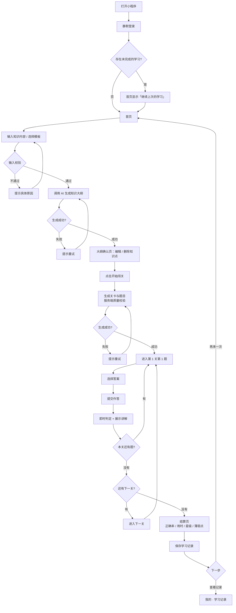
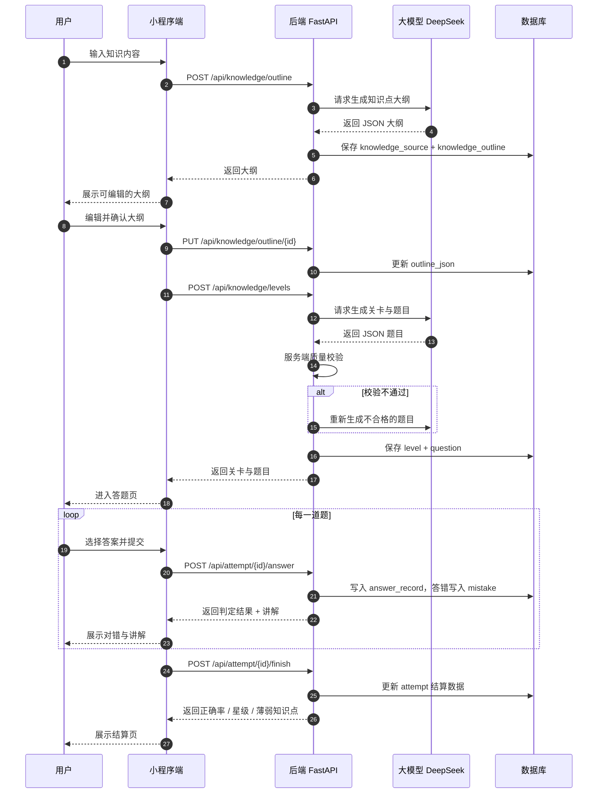
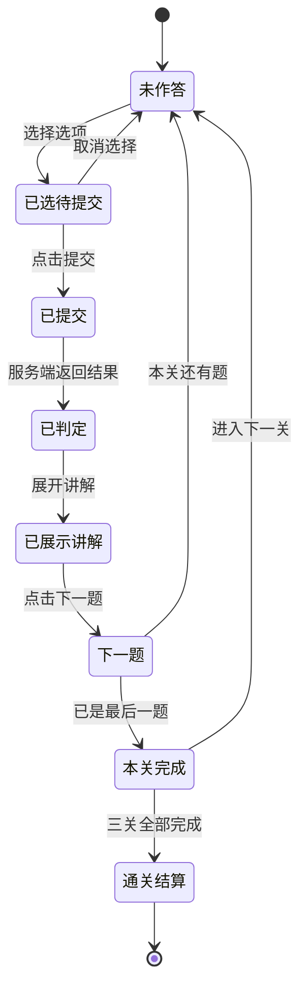
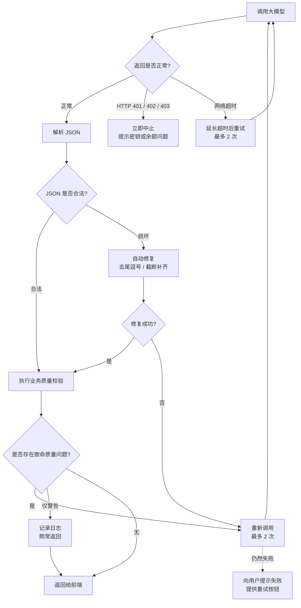
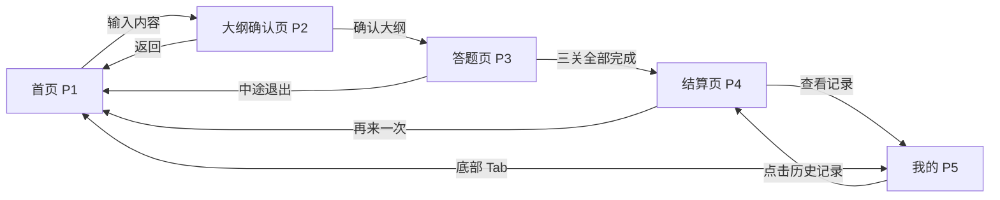
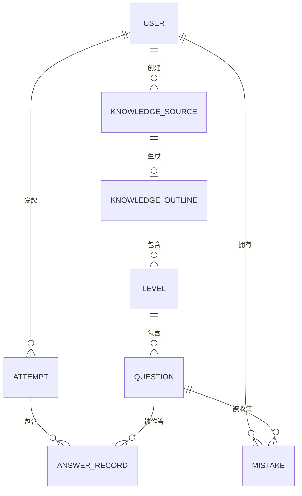

# AI 闯关学习小程序 · 产品需求文档（PRD）

| 项目 | 内容 |
| --- | --- |
| 文档版本 | v1.1 |
| 撰写日期 | 2026-09-14 |
| 产品阶段 | MVP（V0.1） |
| 开发者形态 | 个人开发者（一人） |
| 关联文档 | 《需求分析文档》v1.2、《技术选型分析》v1.0 |
| 文档定位 | **可直接指导开发**：细化到页面级、字段级、接口级 |

**本文档的阅读顺序建议**：第 1 章了解为什么做 → 第 2 章了解 MVP 做什么（开发依据）→
第 3 章了解产品的差异化亮点**怎么设计和实现**（这是本产品的核心竞争力所在）→
第 5 章看流程图 → 第 6 章是执行时的勾选清单。第 4 章是后续版本规划，MVP 阶段可以先跳过。

---

## 1. 需求背景

### 1.1 一句话定位

**把任意一段知识变成一条游戏化学习路径的个人学习引擎。**

用户输入一段想学的内容，AI 自动拆解知识结构、生成闯关题目，用户答题闯关、
答题即讲解、通关拿到复盘报告。

### 1.2 要解决的核心问题

学习最大的障碍不是"没有资料"，而是**启动难、反馈慢、坚持不住**：

| 障碍 | 具体表现 | 本产品的解法 |
| --- | --- | --- |
| 启动难 | 不知道从哪开始，面对大段资料无从下手 | 输入一句话，AI 自动拆出 3–5 个知识点 |
| 反馈慢 | 看完视频不知道自己学会了没有 | 每道题提交后立即判定并讲解 |
| 坚持不住 | 过程枯燥，没有成就感 | 关卡制 + 进度可视化 + 通关星级 |
| 学完就忘 | 没有复习机制 | （V0.5）错题本 + 间隔重复调度 |

### 1.3 为什么这个方向现在成立

三个前提条件同时具备了：

1. **技术前提**：大模型生成结构化客观题的质量已经可用。本项目已用 20 个跨领域样例验证过——
   生成成功率 20/20，内容质量 99.2 分（详见 `reports/` 下的检测报告）。
2. **成本前提**：单次生成约 0.015 元，边际成本可以忽略。
3. **合规前提**：MVP 走体验版路径，不涉及"深度合成"类目，没有上线阻塞。

### 1.4 目标用户

| 优先级 | 用户群 | 特征 | 核心诉求 |
| --- | --- | --- | --- |
| **P0** | 备考大学生（考研、四六级、期末、考证） | 18–24 岁，目标明确但不稳定 | 快速自测、考前突击 |
| **P0** | 公考考编人群 | 22–32 岁，备考周期 3–12 个月 | 刷题效率、错题复盘 |
| P2 | 泛兴趣学习者 | 全年龄，想学但坚持不下来 | 有趣、低门槛、成就感 |

**产品策略**：P0 做深度价值，P2 做传播话题。MVP 阶段**只服务 P0**，
输入框的引导文案与预设模板都围绕备考场景设计。

### 1.5 产品目标（MVP 阶段）

MVP 不是"功能最少的版本"，而是"用最小成本验证最危险假设的版本"。

| 假设 | 验证方式 | 通过标准 |
| --- | --- | --- |
| **H1**：AI 出题质量足够好，用户愿意认真答 | 生成成功率、题目举报率 | 生成成功率 ≥ 95%，无致命缺陷 |
| **H2**：闯关形式确实让人更愿意坚持 | 完赛率（完成全部关卡的比例） | 完赛率 ≥ 50% |
| H3：用户愿意为精准复盘付费 | 留到 V1.0 再验证 | — |

**H1 已初步验证通过**（20/20 成功、99.2 分）。MVP 重点是验证 H2。

### 1.6 明确不做的事（边界）

以下内容在 MVP 阶段**明确排除**，避免范围失控：

| 不做 | 理由 |
| --- | --- |
| 视频 / 音频 / 网页解析 | 工程量最大、体验最不稳定，且对验证核心假设帮助最小 |
| 支付与会员 | 体验版不收费，绕开虚拟支付开通流程 |
| 好友 PK / 排行榜 | 需要用户基数才有意义 |
| 分享海报 | 依赖稳定的结算页，放 V0.5 |
| 题库体系 | 与粉笔等巨头正面竞争没有胜算 |
| 后台管理系统 | 一人开发阶段用数据库工具直接看 |
| 多端（H5 / App） | 小程序优先 |

---

## 2. MVP 最小可行功能点

### 2.1 功能总览

MVP 只做一条完整闭环：**输入知识 → 生成大纲 → 出题 → 答题 → 讲解 → 结算**。

| 编号 | 功能 | 所属页面 | 优先级 | 是否核心闭环 |
| --- | --- | --- | --- | --- |
| F1 | 知识输入（TODU 需实现包括文档） | P1 首页 | P0 | ✅ |
| F2 | 大纲生成与编辑 | P2 大纲确认页 | P0 | ✅ |
| F3 | 关卡与题目生成 | P2 → P3 | P0 | ✅ |
| F4 | 答题闯关与讲解 | P3 答题页 | P0 | ✅ |
| F5 | 通关结算 | P4 结算页 | P0 | ✅ |
| F6 | 学习记录（精简版） | P5 我的 | P1 | ❌ |
| F7 | 微信登录 | 全局 | P0 | ✅ |
| F8 | 数据存储 | 后端 | P0 | ✅ |

### 2.2 功能详细说明

#### F1 知识输入

**说明**：用户输入想学习的知识内容，作为后续出题的原料。

| 项 | 内容 |
| --- | --- |
| 输入 | 纯文本框，**20–2000 字**，支持中文、英文、数字、标点 |
| 模板 | 首页提供 6 个预设快捷入口，点击后自动填入示例文本并可直接编辑 |
| 输出 | 一段待处理的知识文本 |

**快捷模板（MVP 固定 6 个）**：

| 模板名 | 预填内容示例 |
| --- | --- |
| 行测·资料分析 | 增长率与增长量的计算公式及换算关系…… |
| 公基·法律常识 | 行政复议与行政诉讼的区别…… |
| 考研政治 | 矛盾的普遍性与特殊性的辩证关系…… |
| 英语语法 | 虚拟语气的三种时态…… |
| 编程概念 | 二分查找的前提条件与复杂度分析…… |
| 自定义 | 空模板，直接聚焦输入框 |

**校验规则**：

| 情况 | 处理 |
| --- | --- |
| 内容为空 | 按钮置灰，不可点击 |
| 少于 20 字 | 提示"内容太短，再多描述一点吧（至少 20 字）" |
| 超过 2000 字 | 实时字数提示变红，阻止提交并提示"内容太长，建议精简到 2000 字以内" |
| 命中敏感词 | 提示"内容包含不适宜的内容，请修改后重试" |

#### F2 大纲生成与编辑

**说明**：AI 把输入内容拆解为 3–5 个知识点，形成学习大纲。用户可编辑后再确认——
这一步让用户对学习内容有掌控感，也顺带解决了"用户不知道要学什么"的启动难题。

| 项 | 内容 |
| --- | --- |
| 输入 | F1 的知识文本 |
| 处理 | 调用大模型，要求输出 3–5 个知识点（含 id、title、summary） |
| 输出 | 可编辑的知识点列表 |

**页面行为**：

| 操作 | 行为 |
| --- | --- |
| 生成中 | 展示骨架屏 + 循环文案（"正在理解你的内容…"→"正在梳理知识结构…"→"快要好了…"） |
| 编辑标题 | 点击知识点标题进入行内编辑，最长 30 字 |
| 删除知识点 | 左滑删除；**剩余不足 2 个时禁止删除**并提示 |
| 新增知识点 | MVP 不做手动新增（保持范围最小） |
| 确认 | 点击"开始闯关"，把确认后的大纲提交给 F3 |

**异常处理**：

| 异常 | 处理 |
| --- | --- |
| 生成超时（>30 秒） | 展示"生成超时，请重试"，提供重试按钮 |
| 返回格式不合法 | 后端自动修复 → 修复失败则重新调用（最多 2 次）→ 仍失败则提示用户重试 |
| 密钥/余额问题（401/402/403） | 立即中止，提示"服务暂时不可用，请稍后再试"（**不向用户暴露技术细节**） |

#### F3 关卡与题目生成

**说明**：基于确认后的大纲生成闯关题目。

| 项 | 内容 |
| --- | --- |
| 输入 | 已确认的知识大纲 |
| 输出 | **3 个关卡，每关 5 题，共 15 题** |
| 题型 | 单选（single）、多选（multiple）、判断（judge） |
| 难度 | 每道题标注 1–5，整套题目应有梯度 |

**生成规则**（与已通过验证的提示词约束一致）：

1. 每个知识点至少被 1 道题覆盖
2. 单选题 4 个选项、正确答案 1 个；多选题 4 个选项、正确答案 ≥2 个；判断题 2 个选项（正确/错误）
3. 选项 key 从 A 开始连续编号，**答案不得引用不存在的选项**
4. 禁止出现"以上都对""以上都不对"这类无效干扰项
5. 讲解不少于 40 字，必须说明正确选项为什么正确
6. 正确答案分布均匀，不得集中在同一选项
7. 语义不同的题目不得复用同一套选项

**质量校验（服务端执行，不合格就重新生成）**：

| 校验 | 级别 | 处理 |
| --- | --- | --- |
| 答案不在选项中 | 致命 | 重新生成该题 |
| 选项 key 跳号 / 缺号 | 致命 | 重新生成该题 |
| 选项内容完全重复 | 致命 | 重新生成该题 |
| 判断题选项数 ≠ 2 | 致命 | 重新生成该题 |
| 单选题选项数 ≠ 4 | 致命 | 重新生成该题 |
| 多选题正确答案 < 2 | 致命 | 重新生成该题 |
| 出现"以上都对"类选项 | 致命 | 重新生成该题 |
| 题干与其它题高度重复**且选项重合** | 警告 | 记录日志，不阻塞 |
| 讲解过短 | 警告 | 记录日志，不阻塞 |

> 校验规则直接复用 `quality_check.py` 中已验证的逻辑，避免两套标准。

**异常处理**：

| 异常 | 处理 |
| --- | --- |
| 单题重新生成仍失败 | 丢弃该题，从其它题目补足，保证每关 5 题 |
| 整份生成失败 | 提示用户重试，不产生脏数据 |

#### F4 答题闯关

**说明**：产品体验的核心。逐题作答，提交后立即反馈并展示讲解。

| 项 | 内容 |
| --- | --- |
| 入口 | 大纲确认后自动进入第 1 关第 1 题 |
| 单位 | 一关 5 题，共 3 关 |
| 交互 | 选择 → 提交 → 判定 → 讲解 → 下一题 |

**关键规则**：

1. **提交前可修改答案**，提交后不可更改
2. **答对答错都必须展示讲解**（这是核心价值，不是可选项）
3. 多选题**全对才算对**，不设部分得分
4. 每次作答都要记录用时（毫秒），用于后续分析
5. 答错的题记入错题池（数据层先做，UI 放 V0.5）

**反馈设计（直接决定复玩意愿）**：

| 状态 | 视觉 | 音效 | 触感 |
| --- | --- | --- | --- |
| 答对 | 选项变绿 + 对勾动效 | 轻快提示音 | 轻微震动 |
| 答错 | 选项变红 + 正确答案高亮 | 温和提示音（不用刺耳失败音） | 无 |
| 连对 3 题 | 连击数字放大 | 升级音效 | 中等震动 |

**中断与恢复**：

| 情况 | 处理 |
| --- | --- |
| 用户中途退出 | 保存当前进度到本地 + 服务端，首页显示"继续上次的学习"入口 |
| 小程序被切到后台 | 保留答题状态（不要重置） |
| 网络中断提交 | 本地暂存，恢复网络后自动重试 |

#### F5 通关结算

**说明**：一次完整学习后的成果反馈，也是付费转化的最佳触点。

| 项 | 内容 |
| --- | --- |
| 展示内容 | 正确率、总用时、星级、各知识点正确率、薄弱知识点提示 |
| 星级规则 | ≥90% 三星；70–89% 两星；50–69% 一星；<50% 零星 |
| 薄弱知识点 | 正确率低于 60% 的知识点，最多列出 3 个 |
| 操作 | "再来一次"（回首页）、"查看学习记录"（去 P5） |

**文案要求**：不要只给数字，给一句有指向性的建议，例如
"你在「存款准备金率」上正确率 40%，建议重点复习这一块"。

#### F6 学习记录（精简版）

**说明**：MVP 只做**列表 + 回看**，不做趋势图和雷达图（那些放 V0.5）。

| 项 | 内容 |
| --- | --- |
| 列表项 | 知识主题、完成时间、正确率、星级 |
| 排序 | 按完成时间倒序 |
| 分页 | 每次加载 20 条，上拉加载更多 |
| 点击 | 进入该次学习的结算页（只读，不可重新作答） |
| 空状态 | "还没有学习记录，去试试第一个闯关吧" + 引导按钮 |

> 说明：MVP 必须存储完整数据，但只展示最简形式。这样 V0.5 做可视化报告时不用补数据。

#### F7 微信登录

| 项 | 内容 |
| --- | --- |
| 方式 | 静默登录，用户无感知 |
| 时机 | 小程序启动时 |
| 流程 | `wx.login()` 拿 code → 后端换 openid → 查/建用户 → 返回自定义 token |
| 存储 | token 存本地，后续请求带在 Header |
| 异常 | 登录失败不阻塞浏览，但生成大纲等写操作前必须登录成功 |

#### F8 数据存储

**MVP 必须持久化的实体**：用户、知识源、知识大纲、关卡、题目、闯关记录、作答记录、错题池。

---

### 2.3 页面清单与页面级需求

MVP 共 **5 个页面**，底部 2 个 Tab（首页、我的）。

| 编号 | 页面 | 路径（建议） | 说明 |
| --- | --- | --- | --- |
| P1 | 首页 | `pages/index/index` | Tab 页 |
| P2 | 大纲确认页 | `pages/outline/outline` | 非 Tab |
| P3 | 答题页 | `pages/quiz/quiz` | 非 Tab |
| P4 | 结算页 | `pages/result/result` | 非 Tab |
| P5 | 我的 | `pages/mine/mine` | Tab 页 |

#### P1 首页

| 区域 | 元素 | 交互 |
| --- | --- | --- |
| 顶部 | 标题"今天想学点什么？" | — |
| 主输入区 | 多行文本框（占位文案：粘贴一段笔记、讲义或任何想学的内容） | 实时字数统计（右下角 `0/2000`） |
| 模板区 | 6 个模板卡片（横向滑动） | 点击填入对应示例文本 |
| 主按钮 | "开始生成" | 内容合法时可点击；点击后跳 P2 |
| 继续学习 | "继续上次的学习"（有未完成进度时才显示） | 直接回到上次中断的题 |
| 最近学习 | 最近 3 条记录 | 点击进 P4 |

#### P2 大纲确认页

| 区域 | 元素 | 交互 |
| --- | --- | --- |
| 顶部 | 返回、标题"知识大纲" | — |
| 状态区 | 骨架屏 / 错误提示 / 内容 | 三态切换 |
| 列表 | 知识点卡片（序号 + 标题 + 一句话说明） | 点击标题行内编辑；左滑删除 |
| 底部 | "重新生成" + "开始闯关" | 重新生成会丢弃当前大纲 |

#### P3 答题页

| 区域 | 元素 | 交互 |
| --- | --- | --- |
| 顶部 | 返回、进度"第 2 关 · 3/5" | 返回时弹确认框"退出后进度会保留" |
| 进度条 | 当前关卡内的题目进度 | — |
| 题干区 | 题型标签（单选/多选/判断）+ 题干 | — |
| 选项区 | A/B/C/D 选项列表 | 单选点击即选中；多选可多选；判断只有两项 |
| 操作区 | "提交"按钮 | 未选择时置灰 |
| 反馈区 | 判定结果 + 讲解卡片 | 提交后展开，可滚动 |
| 底部 | "下一题" / "完成本关" | 反馈展示后才出现 |

#### P4 结算页

| 区域 | 元素 | 交互 |
| --- | --- | --- |
| 顶部 | 星级动画 | 进入时播放一次 |
| 数据区 | 正确率（大号数字）、用时、答对题数 | — |
| 知识点区 | 各知识点正确率列表，低于 60% 标红 | — |
| 建议区 | 一句针对薄弱点的建议文案 | — |
| 底部 | "再来一次" + "查看学习记录" | 分别跳 P1 / P5 |

#### P5 我的

| 区域 | 元素 | 交互 |
| --- | --- | --- |
| 顶部 | 头像 + 昵称（默认"学习者"） | MVP 不做资料编辑 |
| 数据概览 | 累计学习次数、累计答题数 | — |
| 列表 | 学习记录（主题、时间、正确率、星级） | 点击进 P4 只读模式；上拉加载更多 |
| 底部 | 版本号 | — |

### 2.4 数据模型（字段级）

> 开发期用 SQLite，生产切 PostgreSQL。用 SQLAlchemy 定义，两者代码一致。

**user 用户表**

| 字段 | 类型 | 说明 |
| --- | --- | --- |
| id | BIGINT PK | 自增主键 |
| openid | VARCHAR(64) UNIQUE | 微信 openid |
| nickname | VARCHAR(64) | 昵称，默认"学习者" |
| avatar_url | VARCHAR(512) | 头像，可空 |
| is_member | BOOLEAN | 是否会员（V1.0 用，MVP 恒为 false） |
| member_expire_at | DATETIME | 会员到期时间，可空 |
| created_at | DATETIME | 创建时间 |
| last_login_at | DATETIME | 最近登录时间 |

**knowledge_source 知识源表**

| 字段 | 类型 | 说明 |
| --- | --- | --- |
| id | BIGINT PK | |
| user_id | BIGINT FK | 所属用户 |
| input_type | VARCHAR(16) | `text`（MVP 只有这一种） |
| raw_text | TEXT | 用户输入的原始内容 |
| title | VARCHAR(128) | 由内容首句截取生成 |
| char_count | INT | 字数 |
| created_at | DATETIME | |

**knowledge_outline 知识大纲表**

| 字段 | 类型 | 说明 |
| --- | --- | --- |
| id | BIGINT PK | |
| source_id | BIGINT FK | 关联知识源 |
| user_id | BIGINT FK | 冗余，方便查询 |
| title | VARCHAR(128) | 大纲标题 |
| outline_json | JSON | 知识点数组 `[{id,title,summary}]` |
| status | VARCHAR(16) | `generating` / `ready` / `failed` |
| created_at | DATETIME | |

**level 关卡表**

| 字段 | 类型 | 说明 |
| --- | --- | --- |
| id | BIGINT PK | |
| outline_id | BIGINT FK | |
| seq | INT | 关卡序号，从 1 开始 |
| title | VARCHAR(64) | 如"第 1 关 · 基础概念" |
| knowledge_point | VARCHAR(128) | 对应知识点 |
| question_count | INT | 题目数（默认 5） |

**question 题目表**

| 字段 | 类型 | 说明 |
| --- | --- | --- |
| id | BIGINT PK | |
| level_id | BIGINT FK | |
| outline_id | BIGINT FK | 冗余，便于按大纲取题 |
| seq | INT | 关卡内序号 |
| type | VARCHAR(16) | `single` / `multiple` / `judge` |
| difficulty | TINYINT | 1–5 |
| stem | TEXT | 题干 |
| options_json | JSON | `[{key:"A",text:"..."}]` |
| answer_json | JSON | `["A"]` 或 `["A","B"]` |
| explanation | TEXT | 讲解 |
| hint_json | JSON | 苏格拉底式引导问题（L3，V0.5 使用，MVP 可空） |
| quality_score | TINYINT | 生成时的自检得分（0–100） |
| created_at | DATETIME | |

**attempt 闯关记录表**

| 字段 | 类型 | 说明 |
| --- | --- | --- |
| id | BIGINT PK | |
| user_id | BIGINT FK | |
| outline_id | BIGINT FK | |
| status | VARCHAR(16) | `ongoing` / `finished` |
| total_count | INT | 总题数 |
| correct_count | INT | 答对题数 |
| accuracy | DECIMAL(5,2) | 正确率（0–100） |
| duration_ms | INT | 总用时 |
| star | TINYINT | 0–3 星 |
| started_at | DATETIME | |
| finished_at | DATETIME | 可空 |

**answer_record 作答记录表**

| 字段 | 类型 | 说明 |
| --- | --- | --- |
| id | BIGINT PK | |
| attempt_id | BIGINT FK | |
| question_id | BIGINT FK | |
| user_id | BIGINT FK | 冗余，便于统计 |
| user_answer_json | JSON | 用户选择的 key 数组 |
| is_correct | BOOLEAN | 是否正确 |
| elapsed_ms | INT | 本题用时 |
| answered_at | DATETIME | |

**mistake 错题池表**（MVP 存数据，V0.5 做界面）

| 字段 | 类型 | 说明 |
| --- | --- | --- |
| id | BIGINT PK | |
| user_id | BIGINT FK | |
| question_id | BIGINT FK | |
| wrong_count | INT | 答错次数 |
| mastery | TINYINT | 掌握度 0–100 |
| next_review_at | DATETIME | 下次复习时间（间隔重复用） |
| updated_at | DATETIME | |

**question_report 题目举报表**（L8 第四层兜底机制）

| 字段 | 类型 | 说明 |
| --- | --- | --- |
| id | BIGINT PK | |
| question_id | BIGINT FK | 被举报的题目 |
| user_id | BIGINT FK | 举报人 |
| reason | VARCHAR(32) | `wrong_answer` / `unclear` / `duplicate` / `other` |
| detail | VARCHAR(256) | 补充说明，可空 |
| status | VARCHAR(16) | `pending` / `reviewed` / `ignored` |
| created_at | DATETIME | |

**索引建议**：`attempt(user_id, started_at DESC)`、`answer_record(attempt_id)`、
`question(level_id, seq)`、`mistake(user_id, next_review_at)`、
`question_report(question_id, status)`。

### 2.5 接口清单

统一前缀 `/api`，统一返回 `{code, message, data}`。除登录接口外均需在 Header 带 `Authorization: Bearer <token>`。

| 编号 | 方法 | 路径 | 说明 | 关键入参 | 关键出参 |
| --- | --- | --- | --- | --- | --- |
| A1 | POST | `/api/auth/login` | 微信登录 | `code` | `token`、`user` |
| A2 | GET | `/api/health` | 健康检查（云托管/负载均衡探针用） | — | `status` |
| K1 | POST | `/api/knowledge/outline` | 生成知识大纲 | `raw_text` | `outline_id`、`points[]` |
| K2 | PUT | `/api/knowledge/outline/{id}` | 保存用户编辑后的大纲 | `points[]` | `ok` |
| K3 | POST | `/api/knowledge/levels` | 生成关卡与题目 | `outline_id` | `levels[]`（含题目） |
| K4 | GET | `/api/knowledge/outline/{id}` | 获取大纲详情 | — | `outline`、`levels[]` |
| Q1 | POST | `/api/attempt/start` | 开始一次闯关 | `outline_id` | `attempt_id` |
| Q2 | POST | `/api/attempt/{id}/answer` | 提交单题作答 | `question_id`、`answer[]`、`elapsed_ms` | `is_correct`、`answer[]`、`explanation` |
| Q3 | POST | `/api/attempt/{id}/finish` | 结束并结算 | — | `accuracy`、`star`、`points[]`、`duration_ms` |
| Q4 | GET | `/api/attempt/{id}` | 获取某次闯关详情 | — | 完整结算数据 |
| Q5 | GET | `/api/attempts` | 学习记录列表 | `page`、`size` | `list[]`、`total` |
| Q6 | GET | `/api/attempt/ongoing` | 查询未完成的闯关（用于"继续学习"） | — | `attempt` 或 `null` |

**接口设计要求**：

1. **A1 之后所有写接口必须校验 token**，并从 token 解出 user_id，**不接受前端传 user_id**
2. K1、K3 是耗时接口（10–30 秒），前端必须有加载态；后端建议加超时与重试
3. Q2 的正确答案**只在提交后返回**，题目下发时不能包含 `answer` 字段（防止抓包作弊）
4. 所有接口的异常返回统一格式，`code` 用字符串枚举（如 `LLM_TIMEOUT`、`INVALID_INPUT`）

### 2.6 非功能需求

| 类别 | 要求 |
| --- | --- |
| 性能 | 大纲生成 ≤ 30 秒（P90）；出题生成 ≤ 60 秒；答题提交响应 ≤ 500ms |
| 兼容 | 微信基础库 ≥ 2.30；覆盖 iOS / Android 主流机型 |
| 稳定性 | 大模型调用失败自动重试 2 次；401/402/403 立即中止并友好提示 |
| 安全 | API Key 只存服务端；题目答案不下发；所有写接口校验身份 |
| 合规 | AI 生成内容标注"内容由 AI 生成"；提供用户协议与隐私政策；提供内容举报入口 |
| 成本 | 单次完整学习（15 题）的大模型成本 ≤ 0.05 元 |
| 可维护 | 大模型调用封装为适配层，可切换供应商而不改业务代码 |

---

## 3. 核心设计点与差异化亮点的设计实现

> 这一章回答一个关键问题：**同样是"AI 出题"，凭什么用我们的？**
>
> 需求分析阶段提炼了 12 个差异化设计点（见《需求分析文档》第 5 章），
> 本章把它们落到可执行的设计与实现方案上，并明确每个点的版本归属。

### 3.1 设计点总览与版本归属

| 编号 | 设计点 | 版本归属 | 一句话价值 | 对应扩展功能 |
| --- | --- | --- | --- | --- |
| L1 | 知识原子化 + 关卡地图 | 原子化在 **MVP**，地图可视化在 **V0.5** | 把模糊的"学一章"变成可见的"剩 3 关" | E4 |
| L2 | 自适应难度（心流区间） | **V0.5** | 难度始终匹配水平，不无聊也不挫败 | E14 |
| L3 | 苏格拉底式引导 | **V0.5** | 答错先引导再给答案，才是真正的教学 | — |
| L4 | 间隔重复 | **V0.5** | 把一次性玩具变成每日习惯 | E2 / E3 |
| L5 | 分享海报的社交货币设计 | **V0.5** | 让用户愿意主动发出去，而不只是炫耀分数 | E1 |
| L6 | 好友 PK / 房间对战 | **V2.0** | 微信生态独有的零成本获客 | E12 |
| L7 | 反向出题（费曼学习法） | **V2.0** | 教是最好的学，同类产品几乎没人做 | E13 |
| L8 | 出题质量保障机制 | **MVP**（已实现） | 真正的护城河：出题几乎不出错 | — |
| L9 | 可解释的复盘报告 | **V0.5** | 回答"我到底哪里没懂"，也是付费转化触点 | E4 |
| L10 | 渐进式多模态输入 | V0.5 → V1.0 → V2.0 | 不一次性做完，按工程量递增推进 | E6 / E7 / E17 |
| L11 | "游戏手感"的微交互 | **MVP**（基础）→ V0.5（强化） | 答题瞬间的反馈质量决定复玩意愿 | — |
| L12 | 垂直场景模板 | **MVP**（6 个）→ V1.0（模板库） | 解决新用户面对空白输入框的不知所措 | E11 |

**关于版本归属的说明**：你提到这些核心设计点可以在 V0.5 实现，我认同这个判断，
理由是一致的——**MVP 阶段要验证的是"AI 出题质量"和"闯关形式是否让人愿意坚持"这两个假设**，
而 L2/L3/L4/L5/L9 本质上都是**验证通过之后的留存与增长手段**。
在还没有真实用户之前做这些，属于过早优化。

**但有两点例外，必须留在 MVP**：

- **L8 出题质量保障**：它是 L1–L12 全部设计的前提。题目本身有错，后面的一切都没有意义。
- **L11 微交互的基础部分**：答对/答错的即时反馈是核心闭环的一部分，不是锦上添花。

---

### 3.2 L1 知识原子化 + 关卡地图

**为什么重要**：用户看到"还剩 3 关"和看到"共 50 题"是完全不同的心理感受。
关卡地图提供的是**可见的进度**，这是留存的第一驱动力。

**版本归属**：知识原子化（拆知识点）已在 MVP 实现；**关卡地图可视化放 V0.5**。

**产品设计（V0.5）**：

| 元素 | 设计 |
| --- | --- |
| 地图形态 | 蜿蜒路径式，每关一个节点，纵向排列 |
| 节点状态 | 未解锁（灰色锁）/ 进行中（高亮脉动）/ 已通过（点亮 + 星级） |
| 节点信息 | 关卡序号 + 知识点名称缩略 + 星级 |
| 交互 | 点击已解锁节点进入该关；未解锁给出提示 |
| 位置 | 首页下方"继续学习"区域，或大纲确认页之后独立成页 |

**实现方案**：

- 关卡状态**不新增字段**，由 `attempt` 与 `answer_record` 推导：
  某关题目全部答对 → 三星；答对 ≥80% → 两星；已完成 → 一星；有作答记录但未完成 → 进行中
- 前端用 **SVG 路径 + 绝对定位节点** 绘制，不要用图片（便于适配不同屏幕且体积小）
- 后端提供 `GET /api/outline/{id}/map`，一次返回全部关卡状态，避免逐关查询

**验收标准**：用户能一眼看出自己在哪一关、还剩多少、每关拿了几星；
完成一关后返回到地图，进度实时更新。

---

### 3.3 L2 自适应难度（心流区间）

**为什么重要**：把正确率稳定在 **75%–85%** 是心理学上最容易触发心流的难度区间。
太简单会无聊，太难会挫败，两种情况都会导致流失。

**版本归属**：**V0.5**

**产品设计**：

| 触发条件 | 系统行为 |
| --- | --- |
| 连续答对 3 题 | 下一题难度 +1 |
| 连续答错 2 题 | 难度 -1，并插入一道同知识点的基础巩固题 |
| 单题用时超过 90 秒 | 视为"卡住"，下一题难度 -1 |
| 难度已到边界 | 保持不越界，不报错 |

**实现方案（关键设计）**：

> **不要在答题过程中实时调用大模型生成题目。** 那会让每题都产生几秒等待，
> 直接摧毁答题节奏，同时成本翻好几倍。

正确做法是**预生成难度题池**：

1. 出题阶段，每个知识点生成 **3 个难度档 × 2–3 道题**，共约 15–20 题存入库
2. 每道题已有 `difficulty` 字段（1–5），按难度分桶即可
3. 答题时按规则**从对应难度桶中取下一题**，纯数据库操作，零延迟
4. 题目池耗尽时提前切换关卡，不要让用户感知到"题不够了"

**依赖**：F3 出题引擎需要扩展为"按难度分档生成"（提示词中指定每档题数）。

**验收标准**：难度按规则切换；一次完整学习中，用户正确率落在 70%–90% 区间；
答题过程中无额外等待。

---

### 3.4 L3 苏格拉底式引导

**为什么重要**：这是我认为**最能体现产品品味、也最能和同类产品拉开差距**的一点。
大多数 AI 出题工具的答错处理是"显示正确答案 + 一段讲解"，但学习科学告诉我们，
**直接给答案的效果远不如引导用户自己想起来**。

**版本归属**：**V0.5**

**产品设计（两段式）**：

```
用户答错
   ↓
第一段：不给答案，先给一个更简单的引导问题
   「再想想：如果中央银行要求商业银行缴存更多准备金，银行可用于放贷的钱会变多还是变少？」
   A. 变多    B. 变少    C. 不变
   ↓
用户作答（无论对错）
   ↓
第二段：给出完整讲解 + 明确指出他第一次错在哪
   「正确答案是 B。你刚才选的是 C，说明……」
```

**关键规则**：

1. 引导问题**只有一次**机会，不做无限追问，避免拖长答题节奏
2. 引导问题答对**不计入正确率**（避免刷分），但记录为 `guided_correct`
3. 统计维度新增：**首次正确率** 与 **引导后正确率**，两者差值反映题目难度是否合适
4. 用户可以跳过引导直接看讲解（给没有耐心的用户留出口）

**实现方案（关键设计）**：

> 引导问题**在出题阶段一并预生成**，不要在用户答错时才调用大模型。
> 否则每次答错都要等 3–5 秒，"引导"反而变成"卡顿"。

具体做法：

1. F3 的提示词扩展：为每道题额外生成 `hint` 结构（`hint_stem` / `hint_options` / `hint_answer`）
2. `question` 表新增字段 `hint_json`（JSON，可空）
3. 答错时后端直接从 `hint_json` 返回，响应时间与普通题目提交一致
4. `hint_json` 为空时（极少数情况）降级为直接展示讲解

**验收标准**：答错后能在 **300ms 内**展示引导问题；引导后展示完整讲解；
后台可区分统计"首次正确"与"引导后正确"。

---

### 3.5 L4 间隔重复

**为什么重要**：把"一次性玩具"变成"每日习惯"的关键机制，
也是最难被通用 AI 助手替代的能力——AI 助手没有记忆，我们有。

**版本归属**：**V0.5**（数据层 `mistake` 表在 MVP 已建，只是没有界面）

**产品设计**：

| 元素 | 设计 |
| --- | --- |
| 调度间隔 | 简化版艾宾浩斯：**1 / 3 / 7 / 15 / 30 天** |
| 答对 | 进入下一个间隔 |
| 答错 | **重置回 1 天**，并累计 `wrong_count` |
| 入口 | 首页顶部"今日待复习 N 题"卡片，N > 0 时才显示 |
| 复习模式 | 与正常答题一致，但只出错题，且不重复计入学习记录 |
| 消息召回 | （V1.0）配合订阅消息推送"你有 7 道错题到了复习时间" |

**实现方案**：

1. `mistake` 表字段：`wrong_count`、`mastery`（0–100）、`next_review_at`、`updated_at`
2. 调度规则写在服务端的一个纯函数里，便于单独测试：
   `next_review_at = now + INTERVALS[current_stage]`
3. 首页查询：`SELECT count(*) FROM mistake WHERE user_id=? AND next_review_at <= now()`
4. 掌握度 `mastery` 简单算法：连续答对次数 × 20，上限 100；`mastery = 100` 时不再推送
5. **V1.0 可升级为 FSRS 算法**（Anki 使用的算法），接口设计上预留

**验收标准**：错题能在设定的时间点出现在首页；
复习答对后间隔递进，答错后重置；复习过程不污染正常学习统计。

---

### 3.6 L5 分享海报的社交货币设计

**为什么重要**：海报不能只是"我得了 90 分"——那没有传播力。
要设计成**用户愿意主动发出去的东西**，也就是具备"社交货币"属性。

**版本归属**：**V0.5**

**产品设计：弱设计 vs 强设计**

| 弱设计（不要） | 强设计（要做） |
| --- | --- |
| "我答对了 9/10 题" | "我用 8 分钟搞懂了「量子纠缠」，这是我最容易搞错的 3 个点" |
| 纯分数罗列 | 知识卡片 + 易错点 + 一句个人感想 |
| 单向展示 | "你也来试试这 5 道题"（带小程序码） |

**两种海报模板**：

| 模板 | 内容 | 适用场景 |
| --- | --- | --- |
| 成果型 | 主题 + 正确率 + 星级 + 我的 3 个易错点 | 用户想展示努力 |
| 挑战型 | 主题 + 5 道精选题 + 小程序码 + "看看你能对几道" | 用户想拉朋友一起 |

**实现方案（关键设计）**：

1. **海报在小程序端用 Canvas 2D 绘制**，不要服务端生成图片。
   理由：省服务器存储与带宽，生成速度快，且不用处理图片 CDN。
2. 服务端只提供**结构化数据**：`GET /api/attempt/{id}/poster` 返回
   `{title, accuracy, star, wrong_points[], share_code_url}`，前端负责排版。
3. **挑战型裂变的核心**：小程序码携带 `outline_id` 参数，
   好友扫码后进入"挑战同一套题"页面——**这比分享分数强得多**，
   它把"炫耀"变成了"邀请参与"。
4. 海报上必须带小程序码，且要支持保存到相册（`wx.saveImageToPhotosAlbum`）。

**验收标准**：海报能保存到相册并分享到微信；好友扫小程序码能直接进入同一套题；
分享后能统计到来源（为 V1.0 的裂变分析打基础）。

---

### 3.7 L6 好友 PK / 房间对战

**为什么重要**：这是微信小程序相较于独立 App 和 Web 的**最大结构性优势**——
传播发生在已有的社交关系链里，获客成本接近于零。

**版本归属**：**V2.0**（需要一定用户基数才有意义）

**产品设计**：

```
发起人创建房间  →  分享到微信群  →  好友点击加入  →  实时同步答题
   →  每题显示对手进度  →  全部答完结算排名 + 本轮错题
```

**实现方案**：

| 技术点 | 方案 |
| --- | --- |
| 实时通信 | 微信小程序原生支持 WebSocket（`wx.connectSocket`） |
| 房间管理 | 内存态（Redis）即可，不需要持久化到数据库 |
| 题目来源 | 复用已有 `question` 表，所有玩家答同一套题（公平） |
| 断线处理 | 超时判负；允许中途加入观战 |
| 最小房规 | 3–8 人，5 道题，每题 15 秒 |

**一个设计要点**：**PK 模式必须复用用户已有题库，不要为对战单独出题**，
否则既增加成本，又让对战的题目质量不可控。

**验收标准**：3 人以上能在同一房间完成一局，题目一致、进度实时同步、结算排名正确。

---

### 3.8 L7 反向出题（费曼学习法）

**为什么重要**：**"教是最好的学"**。让用户给 AI 出题，比让用户答题的记忆效果更深。
这是目前同类产品中**几乎没人做过的角度**，作为作品集的技术亮点也非常有说服力。

**版本归属**：**V2.0**

**产品设计**：

```
用户选择知识点 → 写一道题 + 给出正确答案 + 说明为什么这样出题
        ↓
AI 扮演学生作答 → 对用户的题目质量给出评价
        ↓
评价维度：是否考察了核心概念 / 干扰项是否有区分度 / 答案是否唯一 / 表述是否清晰
        ↓
给出改进建议，用户可修改后重新提交
```

**实现方案**：

1. 新增接口 `POST /api/feynman/submit`，入参 `{knowledge_point, stem, options, answer, reason}`
2. **双角色 LLM 调用**：第一次以"学生"身份作答，第二次以"教研专家"身份评价题目质量
3. 输出结构化评分（4 个维度各 0–5 分）+ 文字建议
4. 高质量的原创题目可选择性沉淀进题库（需用户授权），为 UGC 题库打基础

**验收标准**：AI 能识别出"答案不唯一""干扰项无意义"等典型问题；
评价结果对用户有实际指导意义（人工抽检 10 例，≥7 例认可）。

---

### 3.9 L8 出题质量保障机制（真正的护城河）

**为什么重要**：AI 出题的常见缺陷是答案错误、选项模棱两可、题目重复、难度失控。
**解决这些问题的机制，才是产品真正的护城河**——
因为"出题几乎不会出错"这个口碑，比任何动画效果都更能留住用户。

**版本归属**：**MVP（已实现）**

**四层保障体系**：

| 层级 | 机制 | 实现位置 | 状态 |
| --- | --- | --- | --- |
| 第一层：生成层 | 结构化输出 + 13 条硬性约束写进提示词 | 后端提示词 | ✅ 已实现 |
| 第二层：解析层 | JSON 三级修复（去尾逗号 / 截断补齐）+ 失败自动重试 2 次 | `extract_json` / `repair_json` | ✅ 已实现 |
| 第三层：校验层 | 服务端执行致命级检查，不合格的题**不返回给用户** | 复用 `quality_check.py` 规则 | ✅ 已实现 |
| 第四层：兜底层 | 用户举报入口 + 人工复核 + 题目下线 | 前端入口 + 后台 | ⬜ MVP 待补 |

**"刻意不做"的检查项（同样重要）**：

早期版本的检查器有三处过度敏感，会把好题误判成缺陷，
反而引导开发者去修改没有坏的地方。以下情况**刻意不报**：

1. **选项之间高度相似**——最小对照选项是优秀的干扰项设计
2. **句式相同的并列出题**——如"求基期量"与"求增长量"，是便于对比记忆的好设计
3. **讲解里解释错误选项**——"故不选D""若选B则相反"是标准教学写法，不是答案矛盾

**验收标准**：20 个跨领域样例生成成功率 ≥ 95%；
构造含缺陷的题目能被拦截；用户举报的题目可在 24 小时内下线。

---

### 3.10 L9 可解释的复盘报告

**为什么重要**：不要只给一个正确率，要回答**"我到底哪里没懂"**。
报告是**付费转化的最佳触点**——用户看到自己明确的薄弱点，才会愿意为"精准补漏"付费。

**版本归属**：**V0.5**（MVP 只有当次结算页的简版数据）

**产品设计：四个维度**

| 维度 | 内容 | 呈现方式 |
| --- | --- | --- |
| 掌握度分布 | 十几个知识点的正确率分布 | 雷达图 |
| 错误模式识别 | 概念性错误（理解偏差）vs 细节性错误（记忆不准） | 分类标签 + 数量 |
| 纵向趋势 | 同一知识主题多次学习的正确率变化 | 折线图 |
| 行动建议 | "你在「货币政策工具」正确率 40%，建议重看相关知识" | 文字卡片 |

**错误模式怎么判定（这是设计难点）**：

| 模式 | 判定规则 | 教学含义 |
| --- | --- | --- |
| 概念性错误 | **同一知识点下连续或多次答错**（错 ≥2 题） | 整个概念没理解，需要重学 |
| 细节性错误 | 同一知识点只错 1 题，且错误选项与正确答案表述接近 | 概念懂了但记忆不准，需要强化 |
| 粗心性错误 | 用时明显短于平均且答错 | 审题不仔细 |

**实现方案**：

1. 后端聚合 SQL：按 `knowledge_point` 分组统计正确率、错题数、平均用时
2. 图表用 **ECharts for 微信小程序**（ec-canvas），雷达图与折线图都有现成配置
3. 建议文案由**规则模板**生成，不要每次都调 LLM（省成本、更稳定）；
   后续可升级为 LLM 生成个性化建议

**验收标准**：报告能明确指出薄弱知识点并给出可执行建议；
用户能看到同一主题的学习趋势变化。

---

### 3.11 L10 渐进式多模态输入

**为什么重要**：原始需求要支持文档、视频、音频、网页四种输入，方向对，
但**不要一次做完**——每增加一种输入格式，就多一套解析、错误处理和边界情况。

**版本归属**：V0.5 → V1.0 → V2.0 逐级推进

**推进顺序与理由**：

| 阶段 | 输入类型 | 技术方案 | 工程量 | 理由 |
| --- | --- | --- | --- | --- |
| **MVP** | 一句话 / 一段文字 | 无解析成本 | 无 | 最快跑通闭环 |
| **V0.5** | 网页链接 | readability 算法抓正文 + 反爬处理 | 小 | 场景真实："把这个网页变成题" |
| **V1.0** | 文档（PDF / Word） | 解析 → 分块 → RAG 检索后出题 | 中 | **付费意愿最高的场景**（讲义、教材） |
| **V2.0** | 视频 / 音频 | ASR 转录 → 分块 → 出题 | 大 | 最有噱头但最容易拖垮一人开发 |

**关键设计**：

1. **长内容不要一次性投喂大模型**，必须先分块再按需检索（RAG），否则必然超上下文或丢失细节
2. V1.0 引入向量库时，开发期用 Chroma、生产用 pgvector，保持只有**一个数据库**要维护
3. 视频/音频建议先用"第三方 ASR + 人工校对"的半自动方式验证需求，再考虑全自动

**验收标准**：每一级输入都能走通"输入 → 出题 → 答题 → 结算"的完整闭环，
且不破坏已有输入类型的稳定性。

---

### 3.12 L11 "游戏手感"的微交互

**为什么重要**：学习游戏的成败，很大程度上取决于**答题瞬间的反馈质量**。
这个 200 毫秒的反馈，比首页好不好看重要得多。

**版本归属**：**MVP（基础版）→ V0.5（强化版）**

**设计明细**：

| 场景 | 视觉 | 音效 | 触感 | 版本 |
| --- | --- | --- | --- | --- |
| 答对 | 选项变绿 + 对勾扩散动画 | 轻快提示音 | 轻微震动 | MVP |
| 答错 | 选项变红 + 正确答案高亮 | 温和提示音（**不用刺耳的失败音**） | 无 | MVP |
| 提交前的选择 | 选项轻微放大 + 边框高亮 | 无 | 无 | MVP |
| 连对 3 题 | 连击数字放大 + 进度条加速 | 升级音效 | 中等震动 | V0.5 |
| 关卡完成 | 星级逐个点亮动画 | 完成音效 | 中等震动 | V0.5 |
| 通关 | 地图节点点亮 + 背景渐变 | 胜利音效 | 连续震动 | V0.5 |

**实现方案与三个坑**：

1. 音效用小程序 `InnerAudioContext`，**注意首次播放需要用户交互触发**，
   否则会被静默拦截——建议在第一次点击"开始生成"时预加载音效
2. 要**处理手机静音键状态**，静音时不要强制播放
3. 触感用 `wx.vibrateShort`，iOS 上效果有限，不要依赖它传达关键信息

**设计基调提醒**：**不要做成过度刺激的街机风格。**
学习类产品的情绪基调应该是"轻松但有成就感"，而不是"亢奋"。

**验收标准**：答题反馈在 200ms 内出现；动效不卡顿；
静音状态下不报错；真机上音效与震动表现符合预期。

---

### 3.13 L12 垂直场景模板

**为什么重要**：解决产品最致命的问题——**新用户第一次打开时的不知所措**。
与其让用户面对空白输入框发呆，不如给几个一键可用的入口。

**版本归属**：**MVP（6 个固定模板）→ V1.0（可配置模板库）**

**产品设计**：

模板不只是"预填一段文字"，还应该携带**出题偏好**：

| 模板 | 预填内容 | 出题偏好（影响提示词） |
| --- | --- | --- |
| 行测·资料分析 | 增长率与增长量的计算关系…… | 偏重计算类题目，干扰项设置计算陷阱 |
| 公基·法律常识 | 行政复议与行政诉讼的区别…… | 偏重概念辨析，选项设置接近表述 |
| 考研政治 | 矛盾的普遍性与特殊性…… | 强调概念关系与常见误区的辨析 |
| 英语语法 | 虚拟语气的三种时态…… | 偏重例句判断与时态辨析 |
| 编程概念 | 二分查找的前提与复杂度…… | 偏重原理与边界条件 |
| 自定义 | 空模板 | 无特殊偏好 |

**实现方案**：

1. 模板定义为**配置文件（JSON）**，不要硬编码在页面里，便于后续增删：
   ```json
   {
     "id": "xingce_zlfx",
     "name": "行测·资料分析",
     "prefill": "增长率与增长量的计算公式及换算关系……",
     "prompt_hint": "偏重计算类题目，干扰项应设置计算陷阱"
   }
   ```
2. 前端从 `GET /api/templates` 拉取，服务端返回配置
3. `prompt_hint` 拼接到 F3 的出题提示词中，实现"同一引擎、不同侧重"

**验收标准**：点击任一模板能直接开始生成，无需手动输入；
不同模板产出的题目风格有可感知的差异。

---

### 3.14 设计原则总结

这一章的所有设计都遵循四条原则，后续新增功能时也应遵守：

| 原则 | 含义 | 反面案例 |
| --- | --- | --- |
| **预生成优于实时调用** | 所有需要大模型的内容（引导问题、难度题池）都在出题阶段一次性生成 | 用户答错后才调 LLM 生成引导问题 → 卡顿 3–5 秒 |
| **规则模板优于每次调模型** | 建议文案、错误分类等能用规则做好的，就不要每次都调 LLM | 每次展示复盘建议都调一次模型 → 成本高、响应慢 |
| **复用已有资产** | PK、复习、挑战分享都复用同一套题库 | 为对战单独出题 → 成本翻倍且质量不可控 |
| **先验证再优化** | V0.5 的设计再好，也要等 MVP 验证完"出题质量"和"愿不愿意答"再做 | 在没有人用之前先做自适应难度 → 过早优化 |

---

## 4. 后续可以做的扩展功能点

MVP 验证通过后再按下面的优先级推进。

### 4.1 V0.5 · 让产品具备传播力

| 编号 | 功能 | 说明 | 依赖 |
| --- | --- | --- | --- |
| E1 | 分享海报 | 生成"知识卡片"式海报，含主题、正确率、易错点、小程序码 | 结算页 |
| E2 | 错题本 | 自动收集错题，支持一键重练 | mistake 表（MVP 已建） |
| E3 | 间隔重复复习 | 按 1/3/7/15/30 天调度错题重现 | 错题本 |
| E4 | 历史可视化报告 | 知识点雷达图、正确率趋势图、错误模式分析 | ECharts |
| E5 | 收藏与重做 | 收藏好的知识主题，一键重新闯关 | 学习记录 |

**为什么 E1 优先**：作品集演示时，分享海报是最直观的传播性证明；
技术上也是"挑战同一套题"裂变的载体。

### 4.2 V1.0 · 让产品可以运营

| 编号 | 功能 | 说明 | 前置条件 |
| --- | --- | --- | --- |
| E6 | 网页链接解析 | 输入 URL 自动抓正文出题 | — |
| E7 | 文档上传解析 | PDF / Word / txt 解析出题 | 对象存储 |
| E8 | 会员订阅 | 免费版限流 + 会员解锁全部能力 | 转个体工商户 + 开通虚拟支付 |
| E9 | 订阅消息召回 | "你有 7 道错题到了复习时间" | 间隔重复 |
| E10 | 每日推荐 | 基于历史记录推荐今天的复习内容 | 学习记录 |
| E11 | 垂直场景模板库 | 考公五大模块、教资、考研等预置模板 | — |

**为什么 E8 放在这里**：会员订阅需要开通虚拟支付，而虚拟支付要求
小程序完成认证与备案。MVP 走"体验版 + 不收费"路线就是为了绕开这一层。

### 4.3 V2.0 · 建立差异化

| 编号 | 功能 | 说明 |
| --- | --- | --- |
| E12 | 好友 PK / 房间对战 | 群内发起实时竞答，微信生态独有的零成本获客 |
| E13 | 反向出题（费曼模式） | 用户给 AI 出题，AI 评价题目质量 |
| E14 | 自适应难度 | 根据正确率动态调整，把用户稳定在心流区间 |
| E15 | AI 学习搭子人格 | 可选角色人格，提供陪伴与情绪价值 |
| E16 | UGC 题库市场 | 用户公开分享自己生成的题库 |
| E17 | 视频 / 音频解析 | ASR 转录后出题（工程量最大，放最后） |

### 4.4 永远不做

| 不做 | 理由 |
| --- | --- |
| 完整题库体系 | 与粉笔（240 万道题库）正面竞争没有胜算 |
| 直播 / 录播课程 | 重资产，与核心定位无关 |
| 社区论坛 | 冷启动期没有内容供给，反而稀释注意力 |

---

## 5. 用户操作流程图

> 以下均为 Mermaid 文本，可直接在支持 Mermaid 的编辑器（VS Code + Mermaid 插件、
> Typora、GitHub、语雀等）中渲染查看。

### 5.1 核心主流程



### 5.2 AI 出题与答题时序



### 5.3 答题页状态机



### 5.4 异常与降级流程



### 5.5 页面跳转关系



### 5.6 数据实体关系



---

## 6. 需求功能核对清单

以下使用 Markdown 任务列表格式，可直接勾选，也可复制到 GitHub Issue、
飞书、Notion 等工具中作为开发看板。

**编号规则**：`M<模块号>-<序号>`，例如 `M3-02` 表示"大模型接入"模块的第 2 项。

### M1 后端骨架

- [ ] **M1-01 项目初始化**
  - [ ] 创建目录结构：`app/api`、`app/core`、`app/models`、`app/schemas`、`app/services`
  - [ ] 配置依赖：fastapi、uvicorn、sqlalchemy、alembic、pydantic、httpx
  - [ ] 实现配置加载（`.env` → Settings 对象）
  - [ ] 实现统一响应体 `{code, message, data}`
  - [ ] 实现全局异常处理中间件
  - 验收：`uvicorn app.main:app --reload` 可启动，`GET /api/health` 返回 200

- [ ] **M1-02 日志与监控**
  - [ ] 结构化日志（记录每次 LLM 调用的 token 数与耗时）
  - [ ] 请求日志中间件（含 trace id）
  - 验收：每次出题调用都能在日志中查到耗时与 token 消耗

### M2 数据模型与数据库

- [ ] **M2-01 模型定义**：user、knowledge_source、knowledge_outline、level、question、attempt、answer_record、mistake（字段见 2.4 节）
- [ ] **M2-02 数据库连接**：SQLAlchemy 引擎与会话管理，开发期 SQLite
- [ ] **M2-03 迁移工具**：接入 Alembic，生成首个迁移脚本
- [ ] **M2-04 索引**：按 2.4 节的索引建议建立
- [ ] **M2-05 数据访问层**：每张表的基础 CRUD 封装
  - 验收：可脚本化插入/查询全链路数据，无报错

### M3 大模型接入与出题引擎

- [ ] **M3-01 模型适配层**
  - [ ] 定义 `LLMProvider` 抽象接口（`chat` / `chat_json`）
  - [ ] 实现 `DeepSeekProvider`
  - [ ] 实现 `MockProvider`（离线开发与测试用）
  - 验收：切换 Provider 不改业务代码

- [ ] **M3-02 知识大纲生成**
  - [ ] 提示词：从知识文本抽取 3–5 个知识点
  - [ ] 结构化输出校验（Pydantic）
  - 验收：20 个跨领域样例生成成功率 ≥ 95%

- [ ] **M3-03 关卡与题目生成**
  - [ ] 提示词：含 2.2 节 F3 的全部约束
  - [ ] 解析时自动修复损坏 JSON（复用已验证逻辑）
  - [ ] 解析失败自动重试（最多 2 次）
  - 验收：连续 3 次完整运行，无 JSON 解析失败

- [ ] **M3-04 服务端质量校验**
  - [ ] 迁移 `quality_check.py` 中的致命级校验规则
  - [ ] 致命问题触发单题重新生成
  - [ ] 警告级问题只记日志
  - 验收：构造含缺陷的题目输入，能被拦截并重新生成

- [ ] **M3-05 成本与限流**
  - [ ] 记录每次调用的 token 消耗
  - [ ] 单用户每日生成次数限制（防滥用）
  - [ ] 401/402/403 立即中止并友好提示
  - 验收：日志可统计单日总成本

- [ ] **M3-06 用户举报与题目下线**（L8 第四层兜底机制）
  - [ ] 题目卡片提供"这道题有问题"入口（可选原因：答案错误 / 表述不清 / 重复）
  - [ ] 举报写入 `question_report` 表（question_id、user_id、reason、created_at）
  - [ ] 同一题被举报 ≥3 次自动标记为待复核，**暂停出现在新生成的闯关中**
  - [ ] 提供临时下线接口，便于人工处理
  - 验收：举报能落库；被标记的题目不再下发给用户

### M4 后端接口

- [ ] **M4-01 微信登录**：`POST /api/auth/login`（code → openid → token）
- [ ] **M4-02 鉴权中间件**：从 token 解出 user_id，写接口强制校验
- [ ] **M4-03 生成大纲**：`POST /api/knowledge/outline`
- [ ] **M4-04 保存大纲**：`PUT /api/knowledge/outline/{id}`
- [ ] **M4-05 生成关卡**：`POST /api/knowledge/levels`
- [ ] **M4-06 获取大纲详情**：`GET /api/knowledge/outline/{id}`
- [ ] **M4-07 开始闯关**：`POST /api/attempt/start`
- [ ] **M4-08 提交作答**：`POST /api/attempt/{id}/answer`
  - [ ] **题目下发时不能包含 answer 字段**
  - [ ] 答错时写入 mistake 表
- [ ] **M4-09 结束结算**：`POST /api/attempt/{id}/finish`（计算正确率、星级、薄弱知识点）
- [ ] **M4-10 查询接口**：`GET /api/attempt/{id}`、`GET /api/attempts`、`GET /api/attempt/ongoing`
- 验收：用 Swagger UI 能完整走通"登录 → 生成 → 答题 → 结算"全流程

### M5 小程序前端 · 基础

- [ ] **M5-01 项目初始化**：Taro 4 + React + TypeScript（strict 模式）
- [ ] **M5-02 请求封装**：统一 baseURL、token 注入、错误提示、超时重试
- [ ] **M5-03 状态管理**：React Context（用户态、当前闯关态）
- [ ] **M5-04 全局样式**：色彩、字号、间距、圆角规范；适配暗色模式（可选）
- [ ] **M5-05 公共组件**：按钮、卡片、加载中、空状态、错误重试
- [ ] **M5-06 登录流程**：启动时静默登录，token 本地存储

### M6 小程序前端 · 页面

- [ ] **M6-01 P1 首页**
  - [ ] 输入框 + 实时字数统计（20–2000 字校验）
  - [ ] 6 个预设模板卡片
  - [ ] "继续上次的学习"入口（条件展示）
  - [ ] 最近 3 条学习记录
- [ ] **M6-02 P2 大纲确认页**
  - [ ] 生成中骨架屏 + 循环文案
  - [ ] 知识点列表（行内编辑标题、左滑删除）
  - [ ] 剩余不足 2 个时禁止删除
  - [ ] 重新生成 / 开始闯关
- [ ] **M6-03 P3 答题页**
  - [ ] 进度显示（第 X 关 · n/5）+ 进度条
  - [ ] 单选 / 多选 / 判断三种题型适配
  - [ ] 提交前可改答案，提交后锁定
  - [ ] 判定反馈 + 讲解卡片（对错都展示）
  - [ ] 答对/答错/连对的动效、音效、震动
  - [ ] 中途退出确认框 + 进度保存
- [ ] **M6-04 P4 结算页**
  - [ ] 星级动画
  - [ ] 正确率、用时、答对题数
  - [ ] 知识点正确率列表（<60% 标红）
  - [ ] 薄弱知识点建议文案
- [ ] **M6-05 P5 我的**
  - [ ] 用户信息 + 数据概览
  - [ ] 学习记录列表（分页加载）
  - [ ] 空状态引导
- [ ] **M6-06 只读模式**：从学习记录进入结算页时不可重新作答
- [ ] **M6-07 合规元素**
  - [ ] AI 生成内容标注"内容由 AI 生成"
  - [ ] 用户协议与隐私政策入口
  - [ ] 内容举报入口
- 验收：真机上能完整走通一遍，无白屏、无卡死

### M7 联调与测试

- [ ] **M7-01 本地联调**：开发者工具关闭域名校验，前后端打通
- [ ] **M7-02 异常路径测试**：超时、断网、重复提交、中途退出
- [ ] **M7-03 边界测试**：20 字与 2000 字输入、只选 1 个知识点、全部答错
- [ ] **M7-04 真机测试**：iOS + Android 各至少 1 台
- [ ] **M7-05 出题质量回归**：用 `quality_check.py` 跑一轮，成功率 ≥ 95%
- [ ] **M7-06 内测**：找 5–10 人真实试用，收集完成率与反馈

### M8 合规与上线准备

- [ ] **M8-01 用户协议与隐私政策**页面
- [ ] **M8-02 内容安全**：输入过滤 + 生成内容审核
- [ ] **M8-03 AI 内容标识**：在题目与讲解区展示
- [ ] **M8-04 数据可删除**：提供账号注销与数据清除入口
- [ ] **M8-05 体验版发布**：配置体验成员，生成体验版二维码
- [ ] **M8-06（产品化时）** 注册个体工商户 → 小程序认证与备案 → 申请深度合成类目 → 开通虚拟支付

### M9 作品集材料

- [ ] **M9-01 演示视频**：3 分钟内讲清"输入知识 → 闯关答题 → 复盘"
- [ ] **M9-02 技术亮点提炼**：质量评估体系、12 项检查、间隔重复设计
- [ ] **M9-03 部署链路记录**：域名 → 备案 → HTTPS → Nginx → Docker 的过程截图
- [ ] **M9-04 开源仓库**：整理 README 与项目结构

### M10 V0.5 核心设计点（**MVP 验证通过后**再启动）

> 这一组任务对应第 3 章的设计。**不要在 MVP 阶段提前做**——
> 它们都是"留存与增长"手段，前提是已经有真实用户验证过产品价值。

- [ ] **M10-01 L1 关卡地图**
  - [ ] 后端 `GET /api/outline/{id}/map` 返回全部关卡状态与星级
  - [ ] 前端用 SVG 路径 + 绝对定位节点绘制蜿蜒地图
  - [ ] 四种节点状态：未解锁 / 进行中 / 已通过 / 满星
  - 验收：一眼能看出在哪一关、还剩多少、每关几星

- [ ] **M10-02 L2 自适应难度**
  - [ ] 出题引擎扩展为"每知识点 3 个难度档 × 2–3 题"的题池
  - [ ] 实现难度切换规则（连对 3 题 +1 / 连错 2 题 -1 / 单题超 90 秒 -1）
  - [ ] 从对应难度桶取题，**答题过程零延迟**
  - 验收：正确率落在 70%–90% 区间；无额外等待

- [ ] **M10-03 L3 苏格拉底式引导**
  - [ ] 提示词扩展：为每道题预生成 `hint` 结构
  - [ ] `question.hint_json` 字段落库
  - [ ] 答错后展示引导问题（仅一次机会），再展示完整讲解
  - [ ] 统计区分"首次正确"与"引导后正确"
  - 验收：引导问题 300ms 内返回，不产生额外等待

- [ ] **M10-04 L4 间隔重复**
  - [ ] 调度纯函数（1/3/7/15/30 天，答错重置）
  - [ ] 首页"今日待复习 N 题"入口
  - [ ] 复习模式（只出错题，不污染正常统计）
  - 验收：错题按时出现，答对递进、答错重置

- [ ] **M10-05 L5 分享海报**
  - [ ] 后端 `GET /api/attempt/{id}/poster` 返回结构化数据
  - [ ] 前端 Canvas 2D 绘制（成果型 / 挑战型两种模板）
  - [ ] 小程序码携带 `outline_id`，好友扫码进入"挑战同一套题"
  - [ ] 保存到相册并支持分享
  - 验收：扫码能进入同一套题；分享来源可统计

- [ ] **M10-06 L9 可解释复盘报告**
  - [ ] 后端聚合 SQL（按知识点分组统计）
  - [ ] ECharts 雷达图 + 趋势折线图
  - [ ] 错误模式分类（概念性 / 细节性 / 粗心）
  - [ ] 规则模板生成行动建议
  - 验收：能明确指出薄弱知识点并给出可执行建议

- [ ] **M10-07 L11 微交互强化**：连击动效、关卡完成动画、通关地图点亮、音效预加载与静音适配
- [ ] **M10-08 L12 模板配置化**：模板抽成 JSON 配置 + `GET /api/templates`，支持 `prompt_hint`

---

## 附录

### 附录 A：术语表

| 术语 | 含义 |
| --- | --- |
| 知识源 | 用户输入的那段原始内容 |
| 知识大纲 | AI 从知识源拆解出的 3–5 个知识点 |
| 关卡 | 一组题目的集合，MVP 为每关 5 题 |
| 闯关（attempt） | 用户从开始到结算的一次完整答题过程 |
| 薄弱知识点 | 正确率低于 60% 的知识点 |
| 心流区间 | 正确率维持在 75%–85% 的难度状态（V2.0 自适应难度用） |

### 附录 B：埋点建议（MVP 可选）

即使不做完整埋点，也建议至少记录下面 5 个事件，
否则 MVP 结束后无法回答"用户到底卡在哪一步"。

| 事件 | 时机 | 关键参数 |
| --- | --- | --- |
| `input_submit` | 点击开始生成 | 字数、是否使用模板 |
| `outline_ready` | 大纲生成成功 | 耗时、知识点个数 |
| `quiz_start` | 进入答题页 | 关卡数、题目数 |
| `quiz_finish` | 完成全部关卡 | 正确率、总用时、完赛 |
| `quiz_abandon` | 中途退出 | 退出时的题号、已完成题数 |

**最关键的两个指标**：`quiz_finish` / `quiz_start` = 完赛率；
`quiz_abandon` 的退出位置分布 = 用户在哪一步失去耐心。

### 附录 C：变更记录

| 版本 | 日期 | 变更 |
| --- | --- | --- |
| v1.1 | 2026-09-14 | 新增第 3 章《核心设计点与差异化亮点的设计实现》，把《需求分析文档》第 5 章的 12 个亮点落到可执行的设计与实现方案，并明确版本归属；原第 3–5 章顺延为第 4–6 章；数据模型补充 `question.hint_json` 与 `question_report` 表；核对清单新增 M3-06 与 M10 |
| v1.0 | 2026-09-14 | 首版。基于《需求分析文档》v1.2 与已确认的七项决策编写 |

### 附录 D：与其他文档的关系

| 文档 | 作用 | 什么时候看 |
| --- | --- | --- |
| 《需求分析文档》 | 为什么做、市场与竞品、可行性与风险 | 回顾方向、准备作品集讲解时 |
| 《技术选型分析》 | 技术栈怎么选、部署方案对比 | 环境搭建、部署时 |
| **本文档（PRD）** | **做什么、怎么验收** | **开发期间随时对照** |
| 《新手入门-环境准备与脚本运行》 | 环境准备与质量检测脚本使用 | 第一次配环境时 |
| `quality_check.py` | 出题质量自动检测 | 每次改提示词后回归 |

---

*文档结束。开发过程中如有需求变更，请先在附录 C 记录变更，再同步修改对应章节。*
